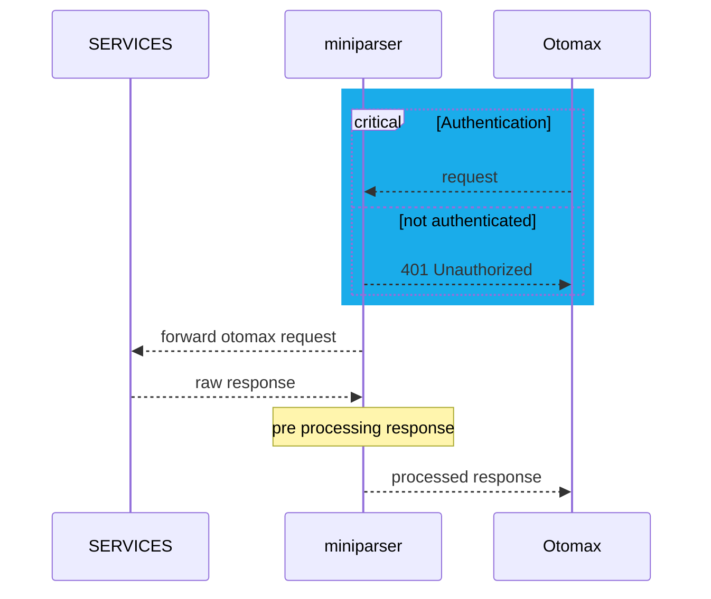

# mkit-miniparser

tools sederhana untuk melakukan pre processing responses pada responses sebelum di kirim ke otomax.

## features

### Authentication

Sebelum melakukan forward request ke Service, Mini parser akan melakukan Authentication terlebih dahulu. Jika gagal, maka akan mengembalikan response 401 Unauthorized.
tahapan auth adalah sebagai berikut:

- check ip address
- check member status
- check signature
- check payload yang akan di kirim ke services

### Pre Forwarding Request

Tahapan pre forwarding request adalah sebagai berikut:

- rebuilding commands yang akan di kirim ke services, seperti konsep parsing pada otomax.
- check availability services (early return jika services tidak tersedia)
- menambahkan data data tambahan yg di butuhkan services.

### forwarding request

- internal Service processing

### Pre Processing Response

miniparser akan melakukan check content type dan length dari response yang di terima dari services, jika content type tidak sesuai maka akan mengembalikan response 500 internal server error.
tahapan pre processing response adalah sebagai berikut:

- check content type
- check content length
- rebuilding response sesuai dengan kebutuhan otomax.
- konsep nya almost menggunakan regex untuk melakukan parsing pada response. seperti untuk :
  - convert content to pydantic model
  - prossing response sesuai dengan kebutuhan otomax.
  - ketika response belum mencapai limit maximal char (7000), maka akan terus melakukan proses parsing hingga mencapai limit maximal char.
  - jika response sudah mencapai limit maximal char (7000), maka akan mengembalikan response 500 internal server error.
- menambahkan data data tambahan yg di butuhkan otomax.

## Technology Stack

check `pyproject.toml` for more details

## installation
